# Data Flow & Decisions Document

## Visual Data Flow Sequence

```mermaid
sequenceDiagram
    autonumber
    
    %% IPC Bridge
    rect rgb(20, 20, 20)
        Note over Frontend (React), Backend (Rust): IPC Bridge Pattern
        Frontend (React)->>Backend (Rust): invoke("command_name", payload) (Asynchronous)
        Backend (Rust)-->>Frontend (React): Promise.resolve(response)
        Backend (Rust)-xFrontend (React): app_handle.emit("event_name", payload) (Push)
    end

    %% Hardware telemetry polling loop
    rect rgb(10, 30, 10)
        Note over Backend (Rust), OS (Windows): Telemetry Polling Loop (every 1000ms)
        loop Every 1000ms
            Backend (Rust)->>OS (Windows): Query CPU/GPU telemetry API
            OS (Windows)-->>Backend (Rust): Raw hardware stats
            Backend (Rust)->>Backend (Rust): Compare/Clamping filters
            Backend (Rust)-xFrontend (React): app_handle.emit("hardware-metrics-update", stats)
            Frontend (React)->>Frontend (React): Zustand store update & re-render
        end
    end

    %% Voice PTT LLM loop
    rect rgb(10, 10, 30)
        Note over Frontend (React), AI Model (Cloud): AI Assistant & Voice PTT Flow
        Frontend (React)->>Backend (Rust): invoke("start_voice_recording")
        Note over Backend (Rust): Record microphone to WAV buffer
        Frontend (React)->>Backend (Rust): invoke("stop_voice_recording") (On Key Release)
        Backend (Rust)-->>Frontend (React): Base64 encoded WAV string
        Frontend (React)->>Backend (Rust): invoke("transcribe_audio_api", { wav_data })
        Backend (Rust)->>AI Model (Cloud): HTTPS Request (Whisper/Groq Speech API)
        AI Model (Cloud)-->>Backend (Rust): Transcribed text
        Backend (Rust)-->>Frontend (React): Transcript text string
        Frontend (React)->>Backend (Rust): invoke("call_ai_api", { prompt, tools })
        Backend (Rust)->>AI Model (Cloud): HTTPS Request (LLM model + tool definitions)
        AI Model (Cloud)-->>Backend (Rust): LLM Response (Text or Tool Call request)
        alt Tool Call Requested
            Backend (Rust)->>Backend (Rust): Execute local system command (e.g. adjust volume, capture screenshot)
            Backend (Rust)->>AI Model (Cloud): Submit tool output
            AI Model (Cloud)-->>Backend (Rust): Final text response
        end
        Backend (Rust)-->>Frontend (React): Chat assistant response text
        Frontend (React)->>Frontend (React): Display PTT card & speak response
    end
```

## The Communication Bridge
Tauri uses an asynchronous Inter-Process Communication (IPC) bridge.
- **Frontend to Backend:** React calls `invoke('command_name', { payload })`.
- **Backend to Frontend:** Rust uses `app_handle.emit("event_name", payload)` to push data.

## Metrics Data Flow
1. Rust background thread wakes up every 1000ms.
2. Rust polls the OS for CPU/GPU data.
3. Rust checks if the new data differs significantly from the last poll.
4. If changed, Rust emits a `hardware-metrics-update` event.
5. Zustand store in React listens for this event and updates its state.
6. The active Widget re-renders with the new data.

## Logging Data Flow
1. An error occurs in a React component.
2. The React Error Boundary catches it.
3. React invokes the Rust command `log_frontend_error(message, stack_trace)`.
4. Rust receives the payload and writes it to `overlay-daily.log` via the `tracing-appender` crate.

## External Integration Flow (OpenRouter / Notion)
1. User interacts with an AI or Notion widget (e.g., sends a chat message, syncs notes).
2. React invokes the corresponding backend command (such as `call_ai_api` or `fetch_notion_notes`) via Tauri's IPC bridge.
3. The Rust backend receives the request, retrieves secure credentials from SQLite, and forwards the HTTP request to the external API (OpenRouter, OpenAI, Anthropic, Groq, or Notion) using `reqwest`.
4. Rust receives the response, parses the data (e.g. token usage and text for LLM calls, or block schemas for Notion), and returns it to the React frontend.
5. The Zustand store in React receives the parsed payload, updates the state, and the widget re-renders.

## Database Flow
1. At the end of a session, Zustand packages the session analytics.
2. React invokes `save_session_analytics(data)`.
3. Rust securely opens the local SQLite connection and executes an `INSERT` statement.